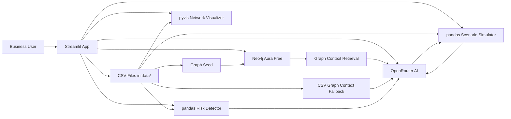
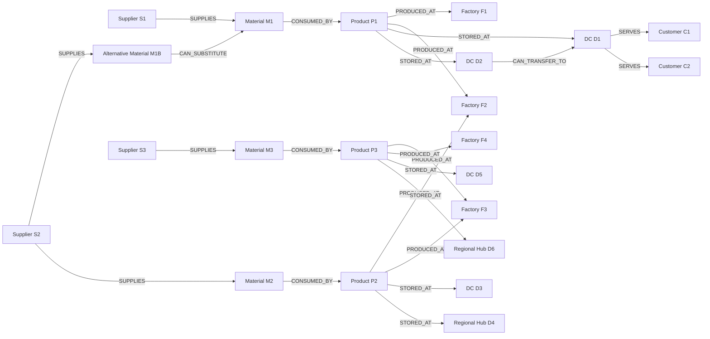
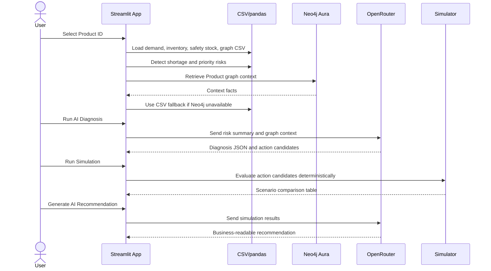
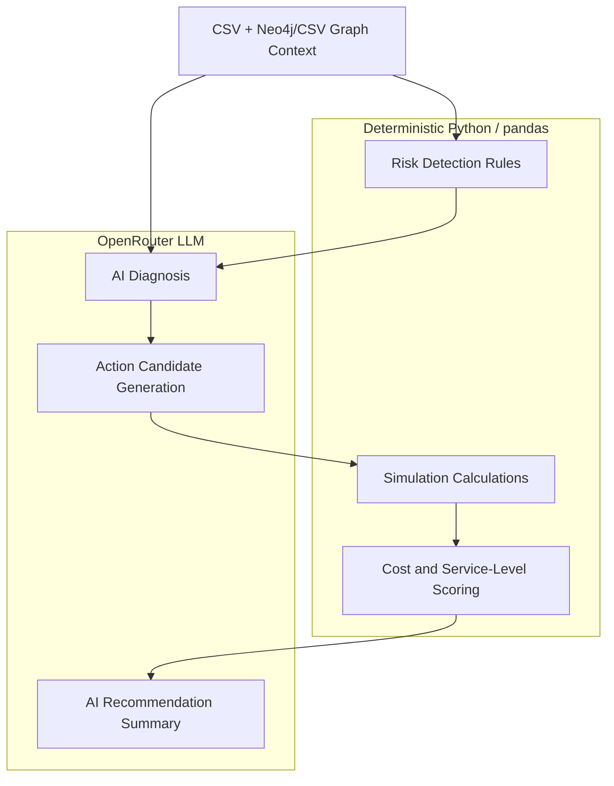
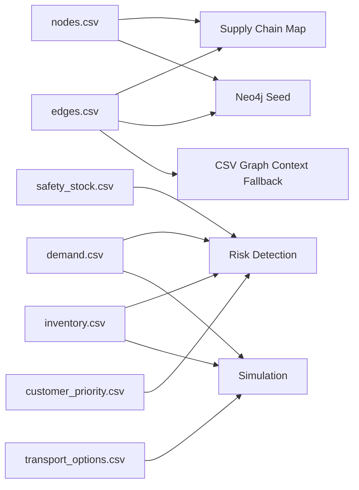

# Supply Chain Ambience Lite

`sc-ambience-lite` is a personal-development MVP inspired by graph-aware supply chain AI experiences such as Project Ambience. It reads supply chain structure and current operational facts, detects shortage risks with pandas, retrieves graph context from Neo4j Aura or CSV fallback, asks OpenRouter for action candidates, and compares scenarios with a small Python simulation.

## Tech Stack

- Streamlit
- pandas
- CSV sample data
- Neo4j Aura Free
- OpenRouter via the OpenAI Python SDK
- pyvis + Streamlit components for interactive network visualization
- GitHub and Streamlit Community Cloud

## Architecture

The app is intentionally small, but separates the main concerns into CSV loading, graph access, risk detection, AI calls, deterministic simulation, and visualization.



## Network Map

The Supply Chain Map tab renders both the full CSV-driven network and a selected Product-centered subgraph. Nodes use different shapes and colors by type, Product nodes are emphasized, edge labels show the relationship name, and the selected Product context is highlighted. The visualization does not require Neo4j; it is built directly from `data/nodes.csv` and `data/edges.csv`. If the visualization library fails, the app falls back to node and edge tables instead of crashing.



The sample data contains three Product-centered supply chains. The overall network shows the full graph, while each Product subgraph is limited to two hops so shared factories or materials are visible without pulling in the entire network.

## App Flow



## AI vs Deterministic Logic

AI is used for interpretation and recommendation text, while calculations stay in Python.



## Local Run

```powershell
cd sc-ambience-lite
python -m venv .venv
.\.venv\Scripts\Activate.ps1
pip install -r requirements.txt
streamlit run app.py
```

Without secrets, CSV display, risk detection, CSV graph context, no-action simulation, and network maps still work.

## Neo4j Aura Free Setup

1. Create a free database at [Neo4j Aura](https://neo4j.com/cloud/platform/aura-graph-database/).
2. Copy the connection URI, username, and password.
3. Add them to `.streamlit/secrets.toml`.
4. Start the app and use **Check Neo4j connection**.
5. Use **Seed sample data to Neo4j** to load the sample graph.

The app validates node labels and relationship types before building Cypher to reduce injection risk.

## OpenRouter Setup

1. Create an API key at [OpenRouter](https://openrouter.ai/).
2. Add the key to `.streamlit/secrets.toml`.
3. Optionally change `OPENROUTER_MODEL`; the default is `openai/gpt-4o-mini`.

## Secrets

Create `.streamlit/secrets.toml` locally by copying `.streamlit/secrets.example.toml`:

```toml
OPENROUTER_API_KEY = "your-openrouter-api-key"
OPENROUTER_MODEL = "openai/gpt-4o-mini"

NEO4J_URI = "neo4j+s://xxxxxxxx.databases.neo4j.io"
NEO4J_USERNAME = "neo4j"
NEO4J_PASSWORD = "your-neo4j-password"
# Leave blank to use the Aura instance's home database.
NEO4J_DATABASE = ""
```

Do not commit `.streamlit/secrets.toml`; it is ignored by `.gitignore`.

## Sample Data

Sample CSV files live in `data/`:

- `nodes.csv`
- `edges.csv`
- `demand.csv`
- `inventory.csv`
- `safety_stock.csv`
- `transport_options.csv`
- `customer_priority.csv`

To seed Neo4j, configure secrets, run the app, then click **Seed sample data to Neo4j** in the sidebar.

The CSV files map to the app modules as follows.



## GitHub Push

After creating an empty GitHub repository:

```powershell
git init
git add .
git commit -m "Initial MVP for Supply Chain Ambience Lite"
git branch -M main
git remote add origin https://github.com/<your-account>/sc-ambience-lite.git
git push -u origin main
```

## Streamlit Community Cloud Deploy

1. Push this repository to GitHub.
2. Log in to [Streamlit Community Cloud](https://streamlit.io/cloud) with your GitHub account.
3. Choose **New app**.
4. Select the repository, branch, and `app.py`.
5. Open **Advanced settings** or the app **Secrets** field.
6. Paste the same TOML values you use in `.streamlit/secrets.toml`.
7. Click **Deploy**.

## Troubleshooting

- If Neo4j is not configured, the app uses CSV graph context and CSV network maps.
- If OpenRouter is not configured, AI diagnosis and recommendation summary show an error, but pandas and simulation features continue.
- If the network chart does not render, confirm `pyvis` and `networkx` installed from `requirements.txt`; tables are shown as fallback.
- If Neo4j seeding fails, verify Aura is running and the URI starts with `neo4j+s://`.
- If an LLM response is not valid JSON, the app catches the parse error path and keeps the raw response available where possible.

## Future Extensions

- Add more products, multi-echelon inventory, and richer allocation logic.
- Persist simulation runs and user decisions.
- Add material shortage and supplier disruption scenarios.
- Add authenticated multi-user deployment.
- Replace simple scoring with optimization or historical service-level learning.
